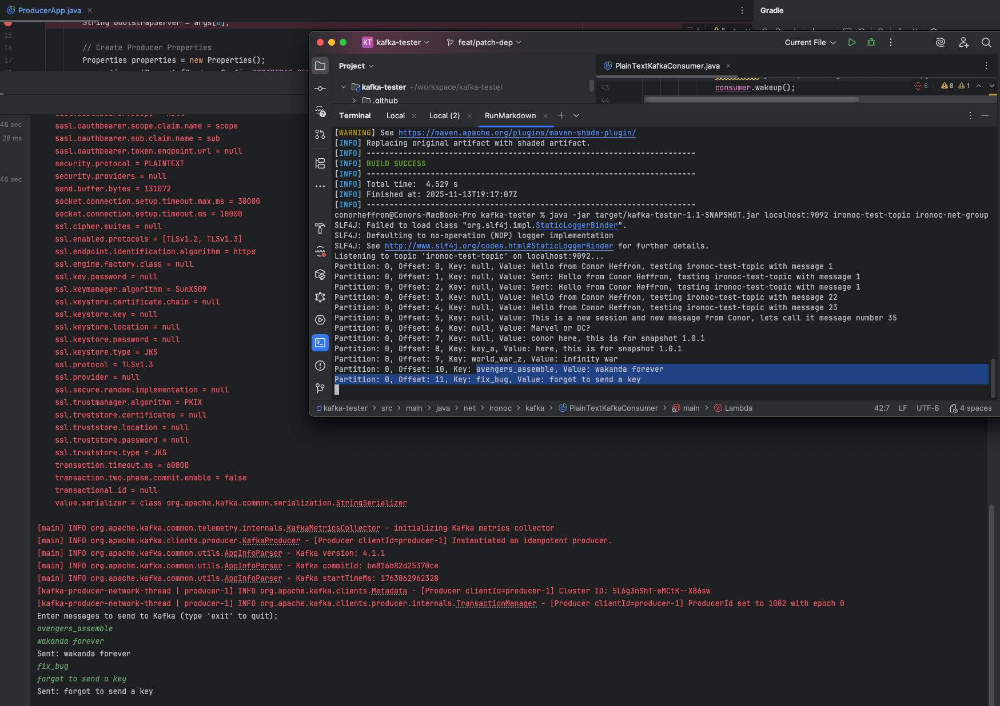
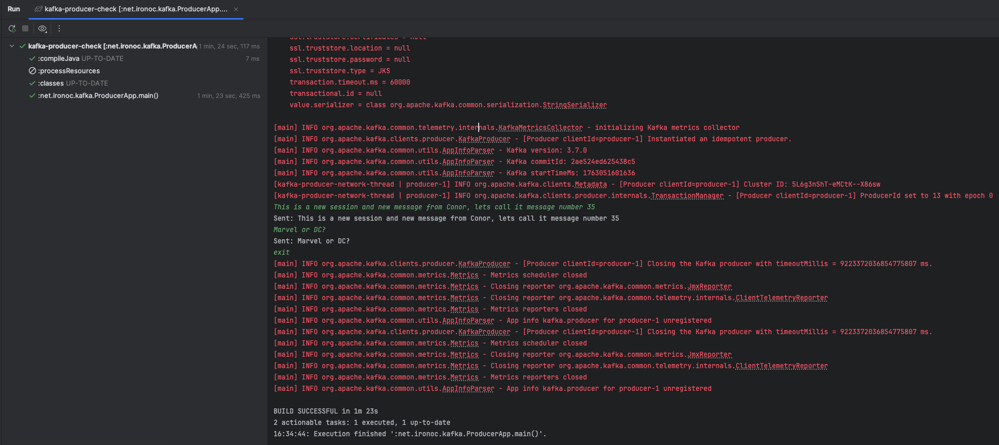

# kafka-producer-check

[](https://github.com/conorheffron/kafka-producer-check/actions/workflows/gradle.yml)

## Tech
- JDK 17, Apache Kafka 3 (Client Libs), & Kafka Broker

## Test Topic Creation & Consumer Subscription from Kafka Broker
```shell
./kafka-topics.sh --bootstrap-server localhost:9092 --create --topic ironoc-test-topic

./kafka-console-consumer.sh --bootstrap-server localhost:9092 --topic ironoc-test-topic --from-beginning
```

## Build Project
```shell
./gradlew clean build
```

## Run Kafka Consumer
```shell
java -jar build/libs/kafka-producer-check-1.0.2.jar localhost:9092 ironoc-test-topic
```

## Enter `key` value & then `value` to send as message


### Further logs


## Exit Application (Enter `exit` in console, highlighted in `GREEN`)
```shell
exit
```

## Verify Messages Sent & Received by default plain text consumer

